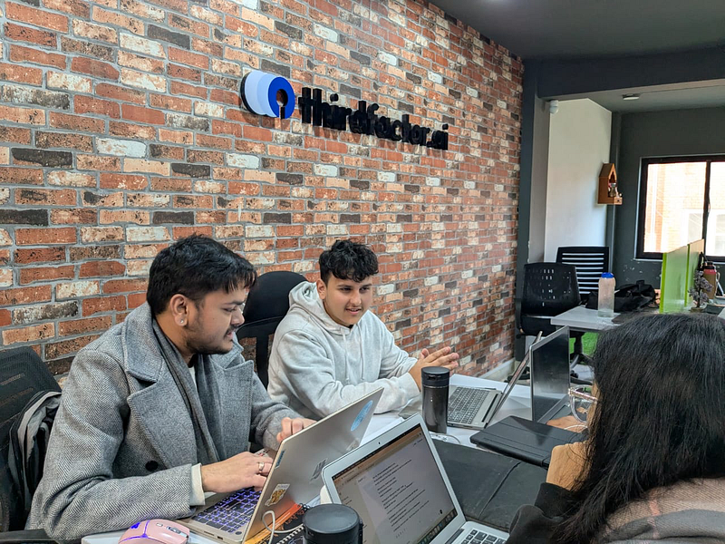

I am realizing that my greatest liability is my own momentum.

There is a seductive comfort in the “halla” of the everyday; the pulse of business, the marketing noise, the immediate, intoxicating fun of team bonding. It is a specific kind of dopamine; it feels like movement, so we mistake it for progress. But lately, I’ve found that when I am down on the floor dancing, I have completely lost the ability to see the stage.

We treat “doing” as the ultimate metric. But if you are part of the friction, you cannot be the one to resolve it.

### Can you sit still and think? for how long?

For a long time, I viewed “sitting and thinking” as a loss in productivity. In a startup culture that wants to fail fast, stillness feels like a brake to the pace.

I was wrong. I am starting to treat the act of observation not as a luxury, but as a **rigorous technical requirement.** If I don’t step back, I cannot see the stack. And if I cannot see the stack, I am not leading; I am simply another variable contributing to the entropy. To orchestrate is to exist in a state of high-fidelity observation. It is the uncomfortable discipline of sitting with a problem until the architecture reveals itself. You aren’t running the lap; you are ensuring the track is built for a pinnacle of creation.

### Designing Autonomy

When the team feels lost; it is largely an outcome of lack of rationale.

I’m experimenting with the **Strategy Pyramid** as a way to build a “containment field” for creativity. It is a cascading logic that moves from the abstract to the empirical:

*   **Mission & Vision:** The existential anchor.
*   **Strategy:** Our opinionated bet on how we win.
*   **Goal & Target KPI:** The measurable proof of our hypothesis.

When we give our teams a clear KPI anchored in this hierarchy, we aren’t just giving them a target; we are giving our teams; **purpose.** We are building the stage and handing the script. This is the only way true autonomy happens; not by leaving people alone, but by providing a structure so clear that they no longer need you to navigate it.

### The Test

Embodying the Scrum values: **Transparency, Inspection, and Adaptation** is easy when you’re looking at a Jira board; it is intensely painful when you are looking at your own leadership.

Transparency demands that I let the team see the fire too. Inspection requires that I watch how the system handles the heat. And the Adaptation is me realizing that my job isn’t to put out the fire, but to resolve the blocker that allowed the spark.

### The Joy of Orchestrator

I am still figuring this out. It is a journey of unlearning the ego of the “individual contributor.” I am learning that my value is no longer measured by the code I write or the emails I send; it is measured by the clarity of the environment I create.

We are treating this existence like a lab. And the experiment is showing a clear, quiet result: the music only happens when the conductor has the courage to stand perfectly still.
