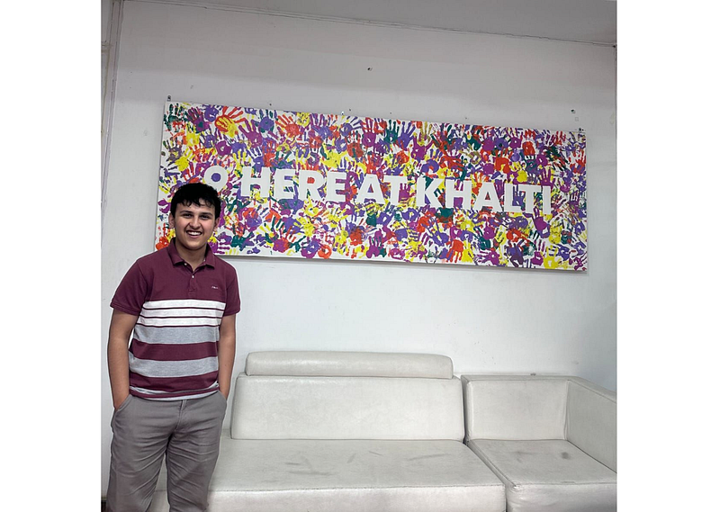
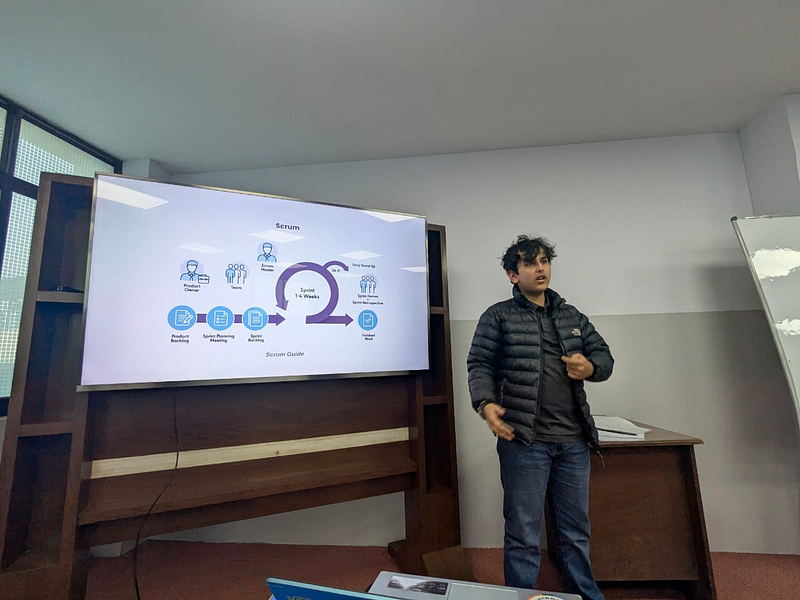

Instinctively, when we look at our lives, we try to optimize for volume. We want more money, more experiences, more skills, more connections. We treat life like a factory line, assuming that if we just speed up the machine, we will eventually manufacture happiness.

But if volume was the answer, the busiest people would be the most fulfilled. They rarely are. After getting deep into Product Management a few years ago, I finally understood the terrifying importance of “Why.” Life isn’t a factory. It is a negotiation with scarcity. You have finite time, finite money, and a rapidly decaying resource called energy. Yet, you are burdened with infinite desires.

So what do you make out of this? How do you map an infinite backlog of desires onto a finite timeline without burning out?

The answer, I realized, was staring me in the face when I was 18.

### The Naivety of the Marketer

Khalti HQ — Post Some Meeting; Circa 2024

When I started my career at Khalti, I was just a kid. I came from a marketing background — creative, chaotic, wired for noise and flash.

I was hired as a Scrum Master. And I hated it.

To my naive 18-year-old brain, “Scrum Master” sounded abstract. It sounded like a made-up role for someone who just organized meetings. I remember walking into the office and asking to have my title changed to “Business Analyst.” [Sudip Dawadi](https://medium.com/u/ecc9fbcbae05) dai (My then Manager, Head of Product) laughed, giggled and handed me the “title” I wanted. (PS. Sudip dai even gifted me the book “The Art of Doing Twice the Work in Half the Time” but I couldn’t read past 50 pages.) Why did I want it? Because “Analyst” sounded serious. It sounded like I had hard skills. It fed my ego.

I look back at that kid now and laugh. **I was handing back the keys to the kingdom because I didn’t recognize the lock.**

It took me a full Product Management career, an interesting entrepreneurship ride, and the collapse of several “ventures” to realize that Scrum wasn’t just a software framework.

It is a survival mechanism for the human condition.

### The Waterfall Fallacy

Most of us try to live life using the “Waterfall” method. We make rigid, long-term plans. We say, “I will study for 4 years, then work for 2, then marry at 28, then buy a house at 30.” We front-load all the risk. We assume the world will stay still while we execute our plan.

But the world doesn’t care about our Gantt chart. The market crashes. We get fired. We fall out of love. A pandemic happens. The plan breaks. And because our identity was tied to the plan, we break too.

This is where the philosophical brilliance of Scrum comes in. It embraces **Empiricism.** It is the radical admission that we cannot know the future, we can only probe it using three pillars: Transparency, Inspection, and Adaptation.

### The Structure of Freedom

Humans are walking paradoxes. We crave freedom, yet we disintegrate without structure. If you give a human total freedom, they get anxiety. If you give them total structure, they get bored. Scrum is the only framework I’ve found that solves this paradox.

It provides a container for chaos.

When I say I “Live in Sprints,” I don’t mean I work faster. I mean I have stopped trying to predict the outcome of my life and started designing it like a laboratory.

Here is the analytical spirituality of the Sprint:

#### 1. Transparency: The Brutal Honesty of the Backlog

In life, we hide our limitations. We pretend we can do it all. Scrum forces **Transparency**. It forces us to put every desire on a board and look at it.

When we see our “Life Backlog” visually, we realize we cannot do 50 things. We can only do 3 things _this sprint_. This isn’t limiting; it is liberating. The “juice” comes from the relief of saying _No_. By being transparent about our finite energy, we stop drowning in potential and start swimming in reality.

#### 2. Inspection: The Courage to Look Within

This is the hardest pillar.

Osho once said that we spend 12 to 16 hours a day looking around us — observing the world — but spend zero minutes looking within. Yet, the entire universe is within.

In the Waterfall life, we grind for years without checking our compass. In a Sprint, we are forced to stop every two weeks for the **Retro**.

We have to ask: _Is this job actually fulfilling me, or just paying me? Is this relationship growing, or stagnating?_ Inspection is painful. It requires us to kill the ego that says “I am always right.” But the pain of inspection is far less than the pain of waking up 10 years later realized you lived the wrong life.

#### 3. Adaptation: The Low Cost of Pivot

Because we sought “Analysis” (certainty), we are terrified of being wrong. Scrum is built on **Adaptation**.

If we treat life as a set of rigid commitments, changing our mind feels like failure. But if we treat life as a set of 2-week hypotheses, changing our mind is just _data_.

*   _“I think I want to be a writer.”_ -> Try it for one sprint.
*   _Result:_ I hated the isolation.
*   _Adaptation:_ Stop writing. Try podcasting.

We didn’t fail a career; we just failed a sprint. The cost is negligible. The lesson is permanent.

#### The Juice of the Ordinary

Speaking Scrum — Deerwalk [2024]

I used to chase complexity because I thought it signaled intelligence. That’s why I wanted that “Analyst” title. I wanted to look smart but complexity is a trap. Simplicity is the discipline.

Rarely do people get to implement Scrum in its purest form, even in tech companies. But once you implement it in your life, you feel a shift. You feel the “juice” in living the simplest of days.

Why? Because you aren’t worried about the 10-year horizon. You are fully present in the 2-week reality. You know that you are heading somewhere close. You know that if you are wrong, you can fix it next sprint. You stop living in the anxiety of the future and start living in the empiricism of the now.

Life is a set of experiments. Design it like one.
