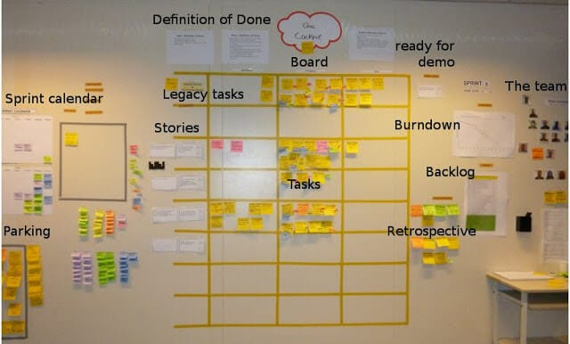
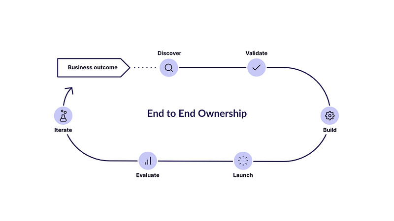
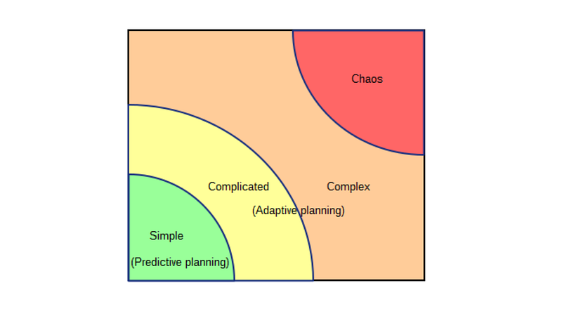

#### the rationale behind the engineering process at Khalti

When you are building critical financial infrastructure for millions to serve, it is important to establish a rationale of why. “Why” behind the product, process, people and the tools at use.
> Read: [The philosophy behind product principles at Khalti](https://medium.com/@seansdaud/product-principle-aspirations-at-khalti-215d8f005f7d)

[Pragmatic Agile — Eylean](https://www.eylean.com/blog/2015/07/top-5-most-interesing-scrum-boards/)

Scrum is a framework that helps teams create value based increments by working in smaller chunks with continuous experimentation and a feedback loop.

It is fundamentally based on empiricism i.e. learning from observing, & doing; and is named after the famous sport rugby, where players work together for one purpose, to move the ball forward.

The idea is simple: have a goal, work towards it on smaller chunks so you can stop by and look back periodically.

### At the core

Rigid workflows fail; strategies grow, goals evolve, requirements and people infinitely change. There is never a “best way to work” but if the process defined itself doesn’t address the fast paced nature of the product, it fails.

Hence, we adopted scrum in a way that happened to work for us.### Fundamentals

Scrum works on its three pillars

*   Transparency
*   Inspection
*   Adaptation

These pillars are essential to Scrum, helping us embody its core values: _Commitment, Focus, Openness, Respect, and Courage_

#### Events

Sprints operate on a 2-week cycle. Before each sprint, there is a 4-hour Sprint Planning session. The outcome of Sprint Planning includes a clear Sprint Goal and a plan for what to build, who will build it, and how.

A daily scrum meeting helps remove blockers and keeps everyone focused on the goal. At the end of each sprint, a Sprint Review is held with stakeholders to review the product increment. If the product increment adds value based on feedback, it goes to release.

A retrospective at the end of sprint; allows teams to sit down, meme, talk, cry together but visualize over what went right, what went wrong and what could be improved. When this happens each sprint; you actually think and make efforts to evolve.

The ultimate outcome should always be an increment. Increment to product, process, people and the tools.

### Transparency

The “Why” is fundamental to us, but a shared understanding of that purpose is even more important. When the objective is clear, collaboration fosters to bring different perspectives out.

Transparency brings trust, fosters innovation, keeps decision-making simple and helps inspect and adapt through the process. A team transparent with self and stakeholders can never go wrong.

Below are few of structured events & forums, we defined for our cross-functional teams to remain transparent:

*   Matrix (Engineering Forum)
*   Product Trio (Product, UX, Engineering Forum)
*   Design Trio (Creative, UX, Product Forum)
*   MarCom Sync (Marketing, Product Forum)
*   CX Sync (Customer Experience, Product Forum)
*   Frio (Internal Product Retrospective Forum)

### Empiricism

[Adrian Camilleri — PhiloshopyMT](https://medium.com/r?url=https%3A%2F%2Fphilosophymt.com%2Funravelling-empiricism-the-quest-for-knowledge-through-experience%2F)

Always lean for measurable experiments. Product, people and processes are never figured out by doing them once, learning should be the goal.

#### Inspect & Adapt

When something is built; it is built to deliver value. As much as it is to build the perfect product that solves all the intended user problem; it is equally important to measure if it did solve or not? Define hypotheses, and measure outcomes.

Sprints help; defining a clear goal, success metric and acceptance criteria for what is the minimum viable product that delivers the value is the quickest way to continuously improve.

### Ownership

[Marcus Andrews — Pendo](https://www.pendo.io/pendo-blog/how-to-use-the-product-management-life-cycle-to-drive-better-business-outcomes/)

Finding meaning in the work is crucial. Meaning comes from a sense of ownership and empowers teams to think beyond just the goal.

When teams truly own what they build; they ultimately drive the success for it. Ownership empowers accountability, faster decision-making and a sense of actual joy for people who work on systems, tools, products and features they build.

From our own observations; the products/features with developers that solely develop; get less riskier, more stable and easy to work on.

### Concluding

The Stacey Complexity Matrix

Nothing is known of — you can only connect the dots looking backwards. Ultimately, the goal with scrum is to help us periodically look back, connect the dots and internalize lessons to evolve.

When we are saying no — we are also saying yes to something else. Ours was scrum, but your “else” doesn’t have to be the same, rather it has to be something that brings value to your product, process and the people at core building them.
