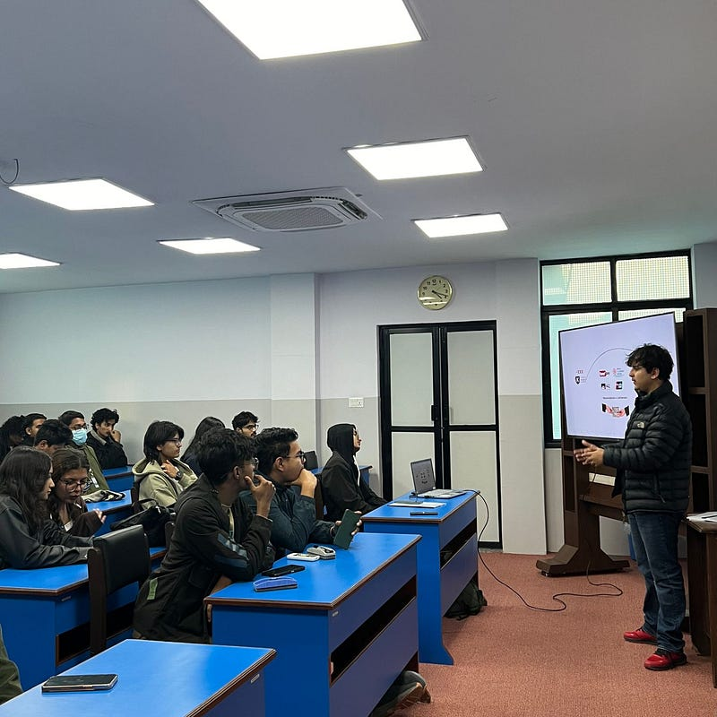
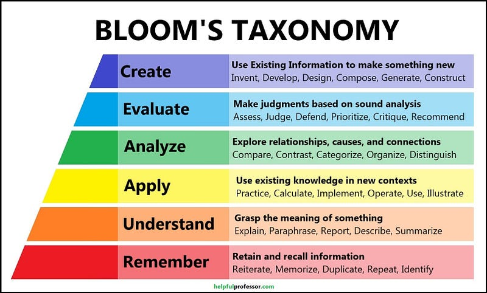
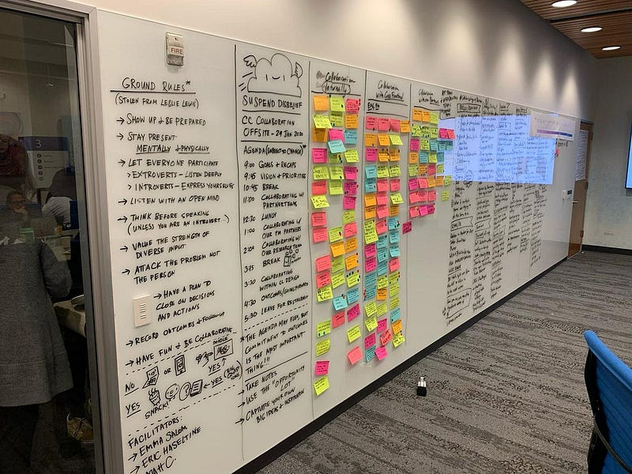
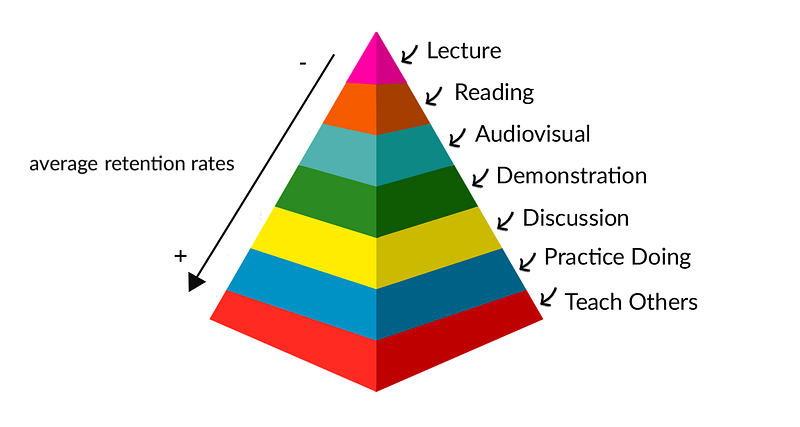

[Benjamin Bloom’s Taxonomy](https://teaching.uic.edu/cate-teaching-guides/syllabus-course-design/blooms-taxonomy-of-educational-objectives/), introduced in 1956, proposed that learning operates across six cognitive levels — Remember, Understand, Apply, Analyze, Evaluate, and Create. Most classroom instruction, even today, operates almost entirely at the bottom two levels. Students remember and understand. Rarely do they apply, analyze, or create within the same session.

Source: [6 levels of understanding](https://helpfulprofessor.com/levels-of-understanding/)

This is the foundational failure of most teaching — and most corporate training, mentorship, and onboarding.

After getting my hands into a few guest lecturing opportunities at colleges, mentoring teams inside product organizations, and onboarding fellow teammates, I have mapped a set of principles that shift teaching from content delivery to outcome production. These are not original discoveries. They are well-documented in learning science. What I am offering is the practitioner’s lens — how they hold up when tested in real rooms, with real people.

### The Curse of Knowledge

Before any framework: there is a cognitive bias that undermines every well-intentioned teacher, manager, and leader.

Once you complete the journey from not knowing to knowing, it becomes nearly impossible to re-inhabit not knowing. You mistake familiarity for clarity. You compress steps that took you years into sentences. The gap between your mental model and theirs is invisible to you — and vast to them.

This is the Curse of Knowledge. Every principle below is a design response to it.

### The Principles

1.  **Bridge Prior Knowledge** [Constructivism]

The brain stores information in relation to what it already knows. Introducing a concept without anchoring it to existing mental models produces the appearance of learning — nodding, note-taking — without actual retention.

**2. Structural Scaffolding First** [Advance Organizers]

When the roadmap of a session is made explicit upfront students begin to self-navigate. Some arrive at the answer before the session reaches it. Not because they were pushed, but because the structure was clear enough to move through independently.

The goal of any session is to make the teacher unnecessary by the end of it.

**3. Output-Oriented Sessions** [Project-Based Learning]

Every session should end with a deliverable. Something written, mapped, built, or shared. It does not have to be large. It has to be tangible.

Learning that produces nothing, proves nothing. If people walk out of a training or offsite with only notes, the session has not done its job.

**4. Retrieval Over Review** [Retrieval Practice + Formative Assessment]

At the end of every session I run, I ask for three things learned — handwritten on a sticky note, not typed. Then separately, one anonymous improvement note on the session.

The first is forced retrieval — the single most evidence-backed method for consolidating knowledge. Pulling information from memory, rather than re-reading it, is what moves it from short-term to long-term. The second makes the teacher a learner too.

**5. Narrative as Implementation Proof** [Narrative Transfer]

There is a gap between understanding a concept and believing it applies to you. Theory closes the comprehension gap. Stories close the implementation gap.

Personal stories in a teaching context are not about warmth. They serve a precise function: they reduce the perceived distance between where the learner is and where the concept lives. They prove the journey is crossable.

**6. The Protégé Effect**

Let the student teach the concept immediately after they learn it.

Preparing to teach forces a more rigorous engagement with the material. You find the gaps in your own understanding. You build a model robust enough to survive questions.

**7. Environment as Precondition [Psychological Safety as Learning Precondition]**

None of the above works inside a room where people do not feel safe to be wrong.

Psychological safety is not a soft prerequisite — it is a structural one. Learning requires the exposure of not-knowing, the risk of a wrong answer, the willingness to sit with confusion. Ice breakers, session norms, accessible design, and how a facilitator responds to the first wrong answer — these are not peripheral. They are the foundation.

I learned most of this not from a book, but from being a student in the classroom of [Ms. Abhilasha Rayamajhi](https://www.linkedin.com/in/abhilasha-rayamajhi), Assistant Professor and Writing Center Lead at the King’s College Nepal. She never explicitly taught me any of it. I absorbed it through observation — which is itself proof of point seven.### TL;DR

Most teaching fails not because of bad content, but because of bad environment design. The Curse of Knowledge makes experts blind to what the learner actually needs.

For leaders who teach, mentor, or run training: the question is not whether you know your subject. The question is whether you have designed the conditions for someone else’s mind to reorganize around it.
