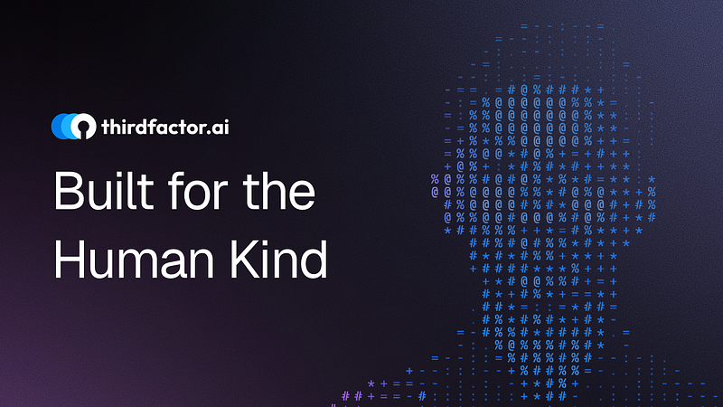

### The Friction of Being

For as long as society has existed, we have been required to prove our existence. But in the transition from the physical to the digital, something vital was lost. Proving who you are — once a matter of a handshake or a familiar face — has become a pain of friction.

We have built a world where your existence is no longer enough. To move, to trade, to access, and to live, you must carry artifacts or memorize secrets. We have turned the simple truth of “I am” into a complex puzzle of “What do I have?” and “What do I remember?”

At ThirdFactor, we believe your existence should be its own proof.

### The Failure of the First Two Factors

The world of security was built on two shaky pillars that were never designed for the weight of the digital age:

*   **The Artifact (What you have):** Physical IDs and government documents are physical artifacts. They are static objects meant for a tactile world, forced into a digital one. They prove you own a piece of paper, not that you are the person on it.
*   **The Secret (What you know):** Passwords and OTPs verify the device, not you. They verify possession, not intent. A password can be stolen; a memory can be coerced. These factors don’t protect the human; they guard the gate.

“The greatest tragedy of modern identity is that we have optimized for the lock, rather than the entity holding the key.”

### The Four Variables of the Human Signature

Identity is not a single data point. It is a symphony of presence. We believe that identifying a human is a composite of four living variables:

1.  **Physical Attributes:** The unique geometry of your form.
2.  **Voice:** The frequency and cadence of your expression.
3.  **Unique Identifiers:** The digital markers that follow your journey.
4.  **Memory and Context:** The lived history and intent that only you possess.

When these four variables align, identity moves from a “transaction” to an “intuition.” It becomes a **Third Factor**: a holistic understanding of the human behind the screen.

### The Seamless Standard

We look at the smartphone and see a glimpse of the future. You pick up your device, and before you have even realized you need to “unlock” it, the face verification has already welcomed you home.

This is the standard the world deserves. Why should unlocking your phone be effortless, while accessing your life’s work, your finances, or your healthcare remains a gauntlet of friction?

**Our vision is simple: If an entity is eligible to do something, they should be able to do it so intuitively that they never feel blocked.**

### Technology in Service of Trust

We are not building a surveillance system; we are building a trust engine.

Identity is the foundation of elevated access. When a business truly knows who it is serving, it can stop defending and start empowering. Our mission is to bridge the gap between “proving you exist” and “being allowed to act.”

Behind every verification is a person saying, _“I am this, and I should be able to do this.”_ ThirdFactor exists to make sure the world hears them. We are bringing the sovereignty of presence back to the heart of every digital interaction. Because when you are the proof, the gates don’t just open — they disappear.**Built for the Human Kind.** _The future of identity isn’t a password or a card. It’s you._
