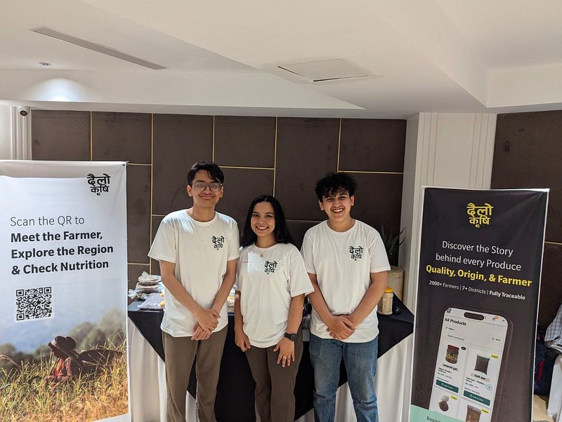
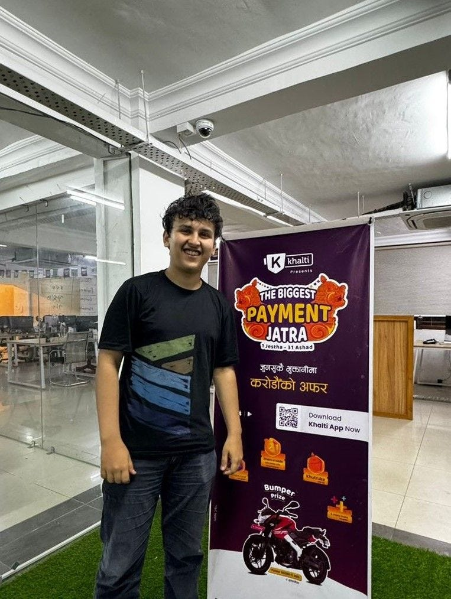

Instinctively when we see a successful venture, we immediately lock into trying to understand its product, the marketing, the business model, the team, the funding, the timing and what not. It is by default how we try and deconstruct a venture to understand what worked for them, and what didn’t.

But if it takes a perfect product, timing, marketing or a business model to succeed, why do some ventures lead and eventually shape the world, and others with the same ingredients die? Why do some ventures outlive competition, burnout, failure, drought, rejection? and most don’t?

I landed to this question a few days back after multiple attempts to figure out why was i not getting the kick? After quitting my job (few months ago), getting validated by industry leaders, hitting some sales, getting a space, building a team; i should by definition have become an “Entrepreneur”. So why was i not getting that “kick”? After all the theory of building a great product is, you figure out a problem for a group that will pay for it, and scale it enough to hit “product market fit”, right?

well, partially right.

### The Risk

A “venture” by definition is a risky undertaking. Risk feels thrilling only in imagination. Most of us including me, take up risk (quitting jobs, dropping out, marrying, bungee jumping) in search for money, fame, brand, legacy, power or influence. When you weigh the risk (leaving a decent paying job) against the imagined reward (exiting for crores), the outcome blinds you.

But when cash is burning, runway is months, co-founders leave, your third pivot fails, and no one funds you; how does the same taraju look now? The risk suddenly outweighs the dream of money, and you quit.

So what is actually worth risking for?

### A Stupid Belief

What is one thing you believe? and what lengths of extent have you gone just to support your belief of it?

A few years ago, after getting into FPS games, I was convinced PC esports would overtake mobile gaming in Nepal. It was true in Europe, LATAM, even India was heading that way: bigger screens, better games, stronger competition, so obviously more audience, right? I built a whole “company” around it, brought school friends, organized tournaments, trying to prove the market was there.

Two years ago, with zero credibility, no degree and no relevant experience, I believed I could land a job at a product company I loved. One cold DM, an 8-page pitch, and a two-hour conversation later, I was hired.

The gist is, beliefs are pure faith in how you think the world should work. The world isn’t perfect, and it gets shaped by people who refuse to accept how it is. When Facebook started, mark believed geographic boundary should be the last thing from letting one connect with other. When Apple started, in a world where computers were seen as janky, and only served for businesses; Jobs believed access to personal computers should be default for everyone.

Take any other company you are fascinated with and see what is one thing they truly believe?

When working at Khalti, the founding team, the management and the people leading truly believed; people hardly switch wallets, and you win by becoming their first one.

### A Strong Stupid Belief

Strong beliefs come from having a few of characteristics like; being highly opinionated, perspective-rich and relentlessly curious to seek depth in ordinary of things. One of founders i know with a 500cr+ company, on a lunch had a perspective on why Mohi helps him feel light. He went on explaining 20+ minutes about the composition of Mohi and how it interacts with our body. Sounds stupid in this context, but the depth of observation and reasoning over something so ordinary of everyday good is exactly what being opinionated looks like.

Just like how individuals are unique to their own thoughts, and beliefs, ventures do too. And this is what the “vision” is all about. The one liner vision we all learn in the business class essential to starting a business, is all about what is that one thing you and your venture truly believe; on how the world should be like.

So, what are you mad, stubborn, and stupidly unshakeable about?
